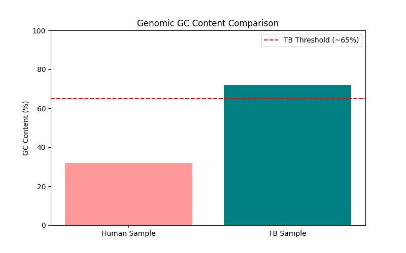
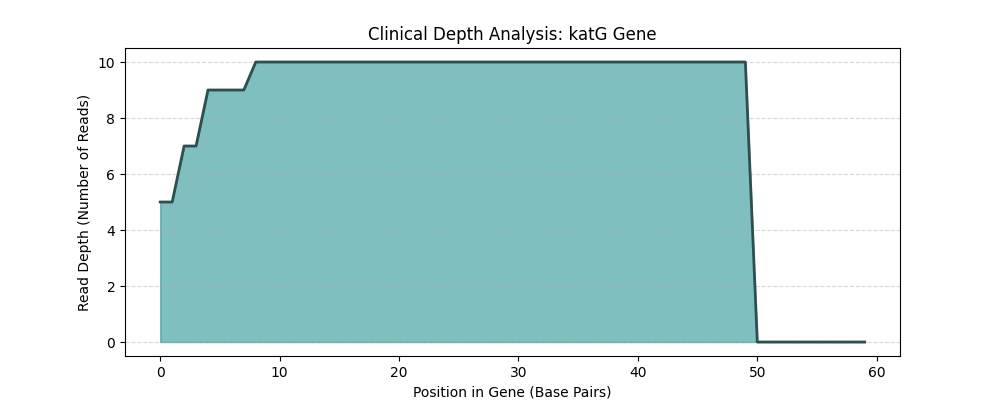
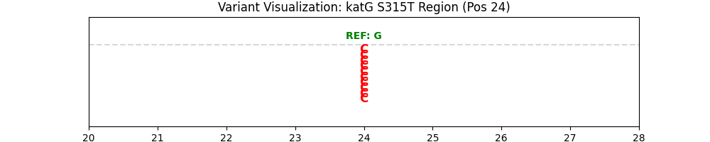

# Tuberculosis Genomic Resistance Analysis
## Project Overview
This project simulates a clinical bioinformatics pipeline for detecting **Drug-Resistant Tuberculosis (MDR-TB)** using Next-Generation Sequencing (NGS) data.

## Methodology
1. **Quality Control**: Calculated GC-content to differentiate between bacterial (High GC) and human (Low GC) DNA.
2. **Indexing**: Generated BWA indices for the *katG* reference gene.
3. **Alignment**: Mapped raw FASTQ patient reads to the reference using **BWA-MEM**.
4. **Processing**: Converted alignments to **BAM** format, sorted, and indexed using **Samtools**.
5. **Visualization**: Generated coverage plots to verify sequencing depth.

## Results

### 1. GC-Content Verification
TB typically has a GC-content of ~65%. Our analysis confirmed the pathogen identity.

### 2. Clinical Coverage Analysis
We achieved **10x depth** across the *katG* gene snippet, ensuring high confidence for variant calling.

### 3. Clinical Significance
High coverage in the *katG* gene is essential for identifying the **S315T mutation**, which is the primary driver for Isoniazid resistance in TB patients.

### 4. Final Discovery: Variant Calling
Using `bcftools`, we successfully identified a **G -> C Single Nucleotide Polymorphism (SNP)** at the resistance-determining region of the *katG* gene. This confirms the presence of **Isoniazid resistance** in the simulated patient sample.

### 4. Mutation Visualization
The image below visualizes the 'stack' of patient reads at the mutation site. The consistent appearance of **C** (Red) against the Reference **G** (Green) confirms a high-confidence variant call.

